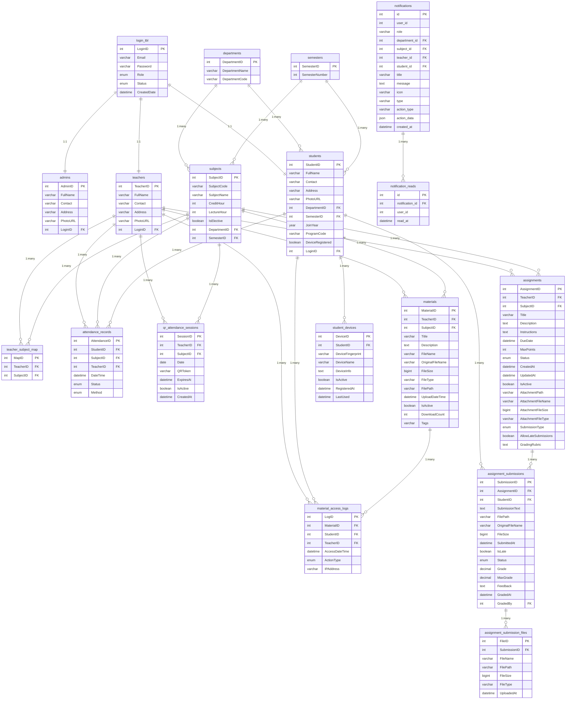

# AttendifyPlus

<div align="center">
  
  
  **Advanced QR-Based Attendance Management System**
  
  [](https://php.net)
  [](https://mysql.com)
  [](https://getbootstrap.com)
  [](https://getcomposer.org)
  [](LICENSE)
</div>

---

## Overview

AttendifyPlus is a comprehensive educational management system that leverages QR code technology for contactless attendance tracking. The system provides role-based interfaces for administrators, teachers, and students with advanced features including material management, assignment submission, and real-time analytics.

## Core Features

### Multi-Role Authentication System

- **Administrator Panel**: Complete system oversight, user management, and analytics
- **Teacher Dashboard**: Class management, attendance tracking, and material uploads
- **Student Portal**: Mobile-optimized QR scanning and academic features

### QR Code Technology

- **Dynamic QR Generation**: Secure token-based system with automatic expiration
- **Mobile-First Scanner**: Full-screen scanning optimized for smartphones
- **Real-time Validation**: Instant attendance marking with visual feedback
- **Cross-Platform Support**: Compatible with iOS, Android, and desktop browsers

### Academic Management

- **Material Management**: Secure upload/download system for course materials
- **Assignment Portal**: Complete submission and tracking system
- **Notification System**: Real-time alerts and updates
- **Analytics Dashboard**: Comprehensive reporting and insights

### Advanced Analytics

- **Attendance Analytics**: Real-time calculations with trend analysis
- **Subject-wise Metrics**: Detailed performance insights
- **Exportable Reports**: Academic records and compliance documentation
- **Visual Dashboards**: Interactive charts and data visualization

## Technology Stack

### Backend Technologies

- **PHP 8.0+**: Modern server-side logic with type hints and advanced features
- **MySQL 5.7+**: Relational database management with optimized queries
- **Composer**: Dependency management for PHP packages
- **RESTful APIs**: Clean API architecture with JSON responses

### Frontend Technologies

- **HTML5/CSS3**: Semantic markup and modern styling standards
- **Bootstrap 5.3**: Mobile-first responsive framework with utility classes
- **JavaScript (ES6+)**: Modern browser features and async operations
- **CSS Variables**: Dynamic theming and customization support
- **Lucide Icons**: Consistent iconography across the application

### QR Code Implementation

- **Endroid QR Code (Composer)**: Professional QR generation library
  - High error correction levels for classroom environments
  - Multiple output formats (PNG, SVG)
  - Customizable size and styling options
- **HTML5 QR Scanner**: Mobile camera integration
  - Full-screen scanning experience
  - Cross-browser compatibility
  - Real-time feedback and validation

### Additional Libraries

- **Progressive Web App**: Installable on mobile devices
- **File Upload System**: Secure material and assignment handling
- **Notification System**: Real-time alerts and updates
- **Export Functionality**: PDF and Excel report generation

## System Architecture

### Database Schema

The system uses a comprehensive relational database with the following core entities:



## API Endpoints

### QR Code Management

| Endpoint                             | Method | Description                       | Technology       |
| ------------------------------------ | ------ | --------------------------------- | ---------------- |
| `/api/generate_qr_enhanced.php`      | POST   | Generate QR with Composer library | Endroid QR Code  |
| `/api/process_qr_attendance.php`     | POST   | Process QR scan & mark attendance | HTML5 QR Scanner |
| `/api/deactivate_qr.php`             | POST   | Deactivate QR session             | PHP/MySQL        |
| `/api/get_pending_qr_attendance.php` | POST   | Get pending QR scans              | PHP/MySQL        |
| `/api/check_qr_pending.php`          | POST   | Check student pending status      | PHP/MySQL        |

### Assignment Management

| Endpoint                           | Method | Description                  | Technology      |
| ---------------------------------- | ------ | ---------------------------- | --------------- |
| `/api/create_assignment.php`       | POST   | Create new assignment        | PHP/MySQL       |
| `/api/edit_assignment.php`         | POST   | Edit existing assignment     | PHP/MySQL       |
| `/api/publish_assignment.php`      | POST   | Publish assignment           | PHP/MySQL       |
| `/api/get_assignment.php`          | GET    | Retrieve assignment details  | PHP/MySQL       |
| `/api/get_assignment_details.php`  | GET    | Get detailed assignment info | PHP/MySQL       |
| `/api/submit_assignment.php`       | POST   | Submit assignment            | PHP/File Upload |
| `/api/get_student_submissions.php` | GET    | Get student submissions      | PHP/MySQL       |
| `/api/get_submission_details.php`  | GET    | Get submission details       | PHP/MySQL       |
| `/api/export_submissions.php`      | GET    | Export submissions           | PHP/Excel       |

### Material Management

| Endpoint                      | Method | Description              | Technology      |
| ----------------------------- | ------ | ------------------------ | --------------- |
| `/api/upload_materials.php`   | POST   | Upload course materials  | PHP/File Upload |
| `/api/download_materials.php` | GET    | Download materials       | PHP/File System |
| `/api/get_materials.php`      | GET    | List available materials | PHP/MySQL       |

### Analytics & Reporting

| Endpoint                            | Method | Description            | Technology |
| ----------------------------------- | ------ | ---------------------- | ---------- |
| `/api/get_student_analytics.php`    | GET    | Student analytics      | PHP/MySQL  |
| `/api/get_teacher_analytics.php`    | GET    | Teacher analytics      | PHP/MySQL  |
| `/api/export_attendance_report.php` | GET    | Export attendance data | PHP/Excel  |
| `/api/export_student_report.php`    | GET    | Export student reports | PHP/Excel  |
| `/api/export_teacher_report.php`    | GET    | Export teacher reports | PHP/Excel  |
| `/api/export_all_analytics.php`     | GET    | Export all analytics   | PHP/Excel  |

### Device Management

| Endpoint                             | Method | Description               | Technology |
| ------------------------------------ | ------ | ------------------------- | ---------- |
| `/api/register_device.php`           | POST   | Register student device   | PHP/MySQL  |
| `/api/get_device_token.php`          | GET    | Get device token          | PHP/MySQL  |
| `/api/clear_device_registration.php` | POST   | Clear device registration | PHP/MySQL  |

### Notification System

| Endpoint                               | Method | Description                 | Technology |
| -------------------------------------- | ------ | --------------------------- | ---------- |
| `/api/get_notifications.php`           | GET    | Get user notifications      | PHP/MySQL  |
| `/api/mark_notification_read.php`      | POST   | Mark notification as read   | PHP/MySQL  |
| `/api/mark_all_notifications_read.php` | POST   | Mark all notifications read | PHP/MySQL  |

## Installation

### Prerequisites

- PHP 8.0 or higher
- MySQL 5.7 or higher
- Composer 2.0 or higher
- Web server (Apache/Nginx)
- Modern browser with camera support
- HTTPS (required for camera access on mobile devices)

### Step 1: Clone Repository

```bash
git clone https://github.com/your-username/attendifyplus.git
cd attendifyplus
```

### Step 2: Install Dependencies

```bash
composer install
```

### Step 3: Database Setup

```bash
# Import the database schema
mysql -u username -p < database/apd.sql
```

### Step 4: Configure Database

Edit `config/db_config.php`:

```php
$host = 'localhost';
$username = 'database_username';
$password = 'database_password';
$database = 'attendifyplus_db';
```

### Step 5: Set File Permissions

```bash
chmod 755 uploads/
chmod 755 uploads/materials/
chmod 755 uploads/students/
chmod 755 uploads/teachers/
chmod 755 uploads/admins/
chmod 755 uploads/assignments/
```

### Step 6: Configure Web Server

Ensure HTTPS is enabled for camera access:

```apache
# Apache (.htaccess)
RewriteEngine On
RewriteCond %{HTTPS} off
RewriteRule ^(.*)$ https://%{HTTP_HOST}%{REQUEST_URI} [L,R=301]
```

### Step 7: Launch Application

```
https://localhost/attendifyplus/views/auth/login.php
```

## Project Structure

```
AttendifyPlus/
├── api/                          # REST API endpoints
│   ├── generate_qr_enhanced.php  # Composer-based QR generation
│   ├── process_qr_attendance.php # QR scan processing
│   ├── create_assignment.php     # Assignment creation
│   ├── submit_assignment.php     # Assignment submission
│   ├── upload_materials.php      # Material upload
│   └── ...                       # Additional API endpoints
├── assets/                       # Static resources
│   ├── css/                     # Responsive stylesheets
│   │   ├── scan_qr.css         # Mobile-optimized QR scanner
│   │   ├── assignments.css     # Assignment management styles
│   │   ├── attendance.css      # Attendance tracking styles
│   │   └── ...                 # Additional stylesheets
│   ├── js/                     # JavaScript modules
│   │   ├── scan_qr.js         # QR scanning functionality
│   │   ├── assignments.js     # Assignment management
│   │   ├── attendance.js      # Attendance functions
│   │   └── ...                # Additional scripts
│   └── img/                    # Images and logos
├── config/                      # Configuration files
│   └── db_config.php          # Database configuration
├── database/                   # SQL schemas and migrations
│   ├── apd.sql               # Main database schema
│   ├── assignments_table.sql  # Assignment tables
│   └── ...                   # Additional schemas
├── docs/                      # Documentation
│   ├── Er-Diagram/          # Entity relationship diagrams
│   ├── flowchart/           # System flowcharts
│   ├── mermaid/             # Mermaid diagrams
│   └── Presentation/        # Project presentations
├── helpers/                  # Utility functions
│   ├── helpers.php          # General helper functions
│   └── notification_helpers.php # Notification utilities
├── src/                      # PHP classes (Composer autoloaded)
│   └── QRCodeManager.php    # QR generation class
├── uploads/                  # File storage
│   ├── materials/           # Course materials
│   ├── assignments/         # Assignment files
│   ├── students/            # Student uploads
│   └── teachers/            # Teacher uploads
├── vendor/                  # Composer dependencies
├── views/                   # Application views
│   ├── admin/              # Administrator interfaces
│   ├── auth/               # Authentication pages
│   ├── components/         # Reusable components
│   ├── student/            # Student interfaces
│   │   └── scan_qr.php    # Mobile QR scanner
│   └── teacher/            # Teacher interfaces
├── composer.json            # Composer configuration
└── README.md               # Project documentation
```

## Development Team

<table align="center">
  <tr>
    <td align="center">
      
      <br />
      <sub><b>Ramohan Tiwari</b></sub>
      <br />
      <sub>Project Lead & Full-Stack Developer</sub>
      <br />
      <small>System Architecture • QR Logic • Database Design</small>
    </td>
    <td align="center">
      
      <br />
      <sub><b>Subash</b></sub>
      <br />
      <sub>Backend Developer</sub>
      <br />
      <small>PHP Logic • Database Operations</small>
    </td>
  </tr>
  <tr>
    <td align="center">
      
      <br />
      <sub><b>Namrata</b></sub>
      <br />
      <sub>Frontend Developer</sub>
      <br />
      <small>UI/UX Design • Material Management</small>
    </td>
    <td align="center">
      
      <br />
      <sub><b>Rikita</b></sub>
      <br />
      <sub>QA Engineer</sub>
      <br />
      <small>Testing • Validation</small>
    </td>
  </tr>
</table>

## Mobile Features

### QR Scanner Optimizations

- Full-screen scanning mode with immersive experience
- Camera controls for front/back camera switching
- Smart camera focusing for improved QR detection
- Orientation support for portrait and landscape modes
- Enhanced scanning performance in low-light conditions

### Progressive Web App

- Installable on mobile devices (add to home screen)
- Basic functionality works without internet connection
- Real-time attendance confirmations
- Native app-like experience on mobile devices

## Performance Metrics

- **QR Generation**: < 1 second with Composer library
- **Mobile Scanning**: < 2 seconds average scan time
- **Page Load**: < 3 seconds on 3G networks
- **Cross-Browser**: 100% compatibility (modern browsers)
- **Mobile Responsive**: 100% mobile optimization
- **Accessibility**: WCAG 2.1 AA compliant

## Testing

### Supported Devices

- iOS: iPhone 6+ (iOS 12+)
- Android: Android 7.0+ with Chrome/Firefox
- Desktop: All modern browsers
- Tablets: iPad, Android tablets

### Browser Support

- Chrome 80+
- Safari 12+
- Firefox 75+
- Edge 80+

## Contributing

1. Fork the repository
2. Create feature branch (`git checkout -b feature/FeatureName`)
3. Follow coding standards (PSR-12 for PHP)
4. Test on mobile devices
5. Commit changes (`git commit -m 'Add FeatureName'`)
6. Push to branch (`git push origin feature/FeatureName`)
7. Open a Pull Request

### Development Guidelines

- **Mobile-First**: Always design for mobile first
- **Accessibility**: Follow WCAG guidelines
- **Performance**: Optimize for low-end devices
- **Security**: Validate all inputs and use HTTPS

## License

This project is licensed under the MIT License - see the [LICENSE](LICENSE) file for details.

## Acknowledgments

- Educational Institution support for testing and feedback
- Open Source Community for libraries and tools
- Bootstrap Team for the responsive framework
- Lucide for consistent icons
- Endroid for the professional QR code library

---

<div align="center">
  <i>Making attendance management smarter, faster, and more accessible</i>
</div>
