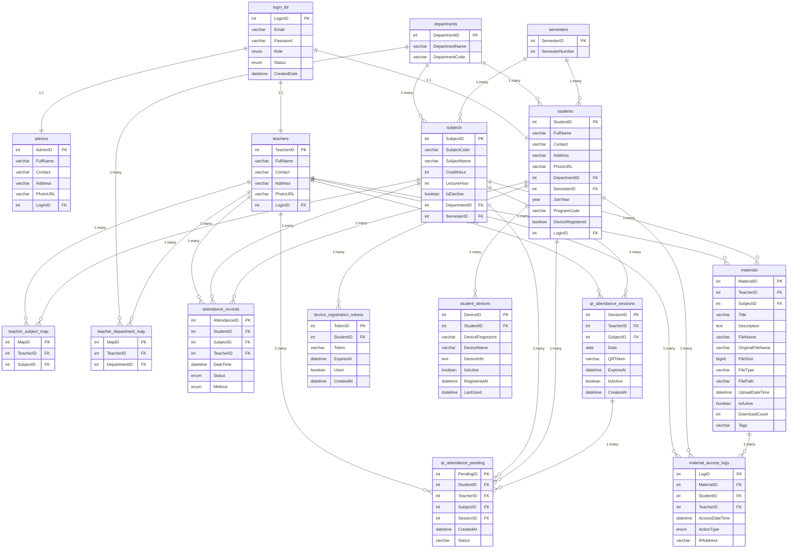

# AttendifyPlus

<div align="center">
  
  
  **Smart QR-Based Attendance Management System**
  
  [](https://php.net)
  [](https://mysql.com)
  [](https://getbootstrap.com)
  [](https://getcomposer.org)
  [](LICENSE)
</div>

---

## Overview

AttendifyPlus is a comprehensive attendance management system that uses QR code technology to provide contactless attendance tracking for educational institutions. The system features real-time attendance monitoring, comprehensive analytics, and role-based management interfaces for administrators, teachers, and students.

## Key Features

### Multi-Role Authentication

- **Admin Panel**: Complete system oversight and user management
- **Teacher Dashboard**: Class management and attendance tracking
- **Student Portal**: Mobile-optimized QR scanning and attendance history

### QR Code Technology

- **Dynamic QR Generation**: Secure token-based system with automatic expiration
- **Mobile-First Scanner**: Full-screen scanning experience optimized for smartphones
- **Real-time Validation**: Instant attendance marking with visual feedback
- **Cross-Platform Support**: Works on iOS, Android, and desktop browsers

### Analytics & Reporting

- **Attendance Percentage**: Real-time calculations with trend analysis
- **Subject-wise Metrics**: Detailed performance insights
- **Comprehensive Reports**: Exportable data for academic records
- **Visual Dashboards**: Interactive charts and graphs

### Additional Features

- **Material Management**: Upload/download system for course materials
- **Assignment Portal**: Submission and tracking system
- **Responsive UI**: Modern design with dark/light theme support
- **Progressive Web App**: Installable on mobile devices
- **Real-time Notifications**: Instant feedback and alerts

## Recent Updates (2025)

### Mobile QR Scanner Redesign

- Student info card maintains horizontal layout on all devices (320px to desktop)
- Touch-optimized interface with 44px minimum touch targets for accessibility
- Full iOS support with proper webkit prefixes for Safari compatibility
- Optimized for mobile landscape orientation
- Improved performance with reduced load times and smooth animations

### Modern Web Standards

- Updated meta tags for mobile web app capability
- Full Safari, Chrome, Firefox, and Edge support
- WCAG 2.1 compliant with proper focus states
- Optimized performance for low-end devices

## Technology Stack

### Backend

- **PHP 8.0+** - Server-side logic with modern features
- **MySQL 5.7+** - Database management
- **Composer** - Dependency management for QR generation
- **RESTful APIs** - Clean API architecture

### Frontend

- **HTML5/CSS3** - Semantic markup and modern styling
- **Bootstrap 5.3** - Mobile-first responsive framework
- **JavaScript (ES6+)** - Modern browser features
- **CSS Variables** - Dynamic theming support
- **Lucide Icons** - Modern iconography

### Libraries & Tools

- **Endroid QR Code** - Professional QR generation via Composer
- **HTML5 QR Scanner** - Mobile camera QR scanning
- **Progressive Enhancement** - Graceful degradation for older browsers

## Prerequisites

- PHP 8.0+
- MySQL 5.7+
- Composer 2.0+
- Web Server (Apache/Nginx)
- Modern Browser with camera support
- HTTPS (required for camera access on mobile)

## Installation

### 1. Clone Repository

```bash
git clone https://github.com/your-username/attendifyplus.git
cd attendifyplus
```

### 2. Install Dependencies

```bash
composer install
```

### 3. Database Setup

```bash
# Import the database schema
mysql -u username -p < database/apd.sql
```

### 4. Configure Database

```php
// config/db_config.php
$host = 'localhost';
$username = 'database_username';
$password = 'database_password';
$database = 'attendifyplus_db';
```

### 5. Set Permissions

```bash
chmod 755 uploads/
chmod 755 uploads/materials/
chmod 755 uploads/students/
chmod 755 uploads/teachers/
chmod 755 uploads/admins/
```

### 6. Configure Web Server

Ensure your web server serves the application over HTTPS for camera access:

```apache
# Apache (.htaccess)
RewriteEngine On
RewriteCond %{HTTPS} off
RewriteRule ^(.*)$ https://%{HTTP_HOST}%{REQUEST_URI} [L,R=301]
```

### 7. Launch Application

```
https://localhost/attendifyplus/views/auth/login.php
```

## Project Structure

```
AttendifyPlus/
├── api/                      # REST API endpoints
│   ├── generate_qr_enhanced.php    # Composer-based QR generation
│   ├── process_qr_attendance.php   # QR scan processing
│   └── ...
├── assets/                   # Static resources
│   ├── css/                 # Responsive stylesheets
│   │   ├── scan_qr.css     # Mobile-optimized QR scanner
│   │   └── ...
│   ├── js/                  # JavaScript modules
│   └── img/                 # Images & logos
├── config/                   # Configuration files
├── database/                # SQL schemas & migrations
├── docs/                    # Documentation & ER diagrams
├── helpers/                 # Utility functions
├── src/                     # PHP classes (Composer autoloaded)
│   └── QRCodeManager.php   # QR generation class
├── uploads/                 # File storage
├── vendor/                  # Composer dependencies
├── views/                   # Application views
│   ├── admin/              # Admin management
│   ├── auth/               # Authentication
│   ├── components/         # Reusable components
│   ├── student/            # Student features
│   │   └── scan_qr.php    # Mobile QR scanner
│   └── teacher/            # Teacher functionality
├── composer.json            # Composer configuration
└── README.md               # Documentation
```

## Development Team

<table align="center">
  <tr>
    <td align="center">
      <br />
      <sub><b>Ramohan Tiwari</b></sub><br />
      <sub>Project Lead & Full-Stack Developer</sub><br />
      <small>System Architecture • QR Logic •  Database Design</small>
    </td>
    <td align="center">
      <br />
      <sub><b>Subash</b></sub><br />
      <sub>Backend Developer</sub><br />
      <small>PHP Logic • Database Operations</small>
    </td>
  </tr>
  <tr>
    <td align="center">
      <br />
      <sub><b>Namrata</b></sub><br />
      <sub>Frontend Developer</sub><br />
      <small>UI/UX Design • Material Management</small>
    </td>
    <td align="center">
      <br />
      <sub><b>Rikita</b></sub><br />
      <sub>QA Engineer</sub><br />
      <small>Testing • Validation</small>
    </td>
  </tr>
</table>

## System Architecture

### Database Schema



## API Endpoints

| Endpoint                             | Method | Description                       |
| ------------------------------------ | ------ | --------------------------------- |
| `/api/generate_qr_enhanced.php`      | POST   | Generate QR with Composer         |
| `/api/process_qr_attendance.php`     | POST   | Process QR scan & mark attendance |
| `/api/deactivate_qr.php`             | POST   | Deactivate QR session             |
| `/api/get_pending_qr_attendance.php` | POST   | Get pending QR scans              |
| `/api/check_qr_pending.php`          | POST   | Check student pending status      |

## Mobile Features

### QR Scanner Optimizations

- Full-screen scanning mode with immersive experience
- Camera controls to switch between front/back cameras
- Smart camera focusing for better QR detection
- Orientation support for both portrait and landscape
- Enhanced scanning performance in low-light conditions

### Progressive Web App

- Installable on mobile devices (add to home screen)
- Basic functionality works without internet connection
- Real-time attendance confirmations
- Native app-like experience on mobile

## Performance Metrics

- QR Generation: < 1 second with Composer library
- Mobile Scanning: < 2 seconds average scan time
- Page Load: < 3 seconds on 3G networks
- Cross-Browser: 100% compatibility (modern browsers)
- Mobile Responsive: 100% mobile optimization
- Accessibility: WCAG 2.1 AA compliant

## Testing

### Supported Devices

- iOS: iPhone 6+ (iOS 12+)
- Android: Android 7.0+ with Chrome/Firefox
- Desktop: All modern browsers
- Tablets: iPad, Android tablets

### Browser Support

- Chrome 80+
- Safari 12+
- Firefox 75+
- Edge 80+

## Contributing

1. Fork the repository
2. Create feature branch (`git checkout -b feature/FeatureName`)
3. Follow coding standards (PSR-12 for PHP)
4. Test on mobile devices
5. Commit changes (`git commit -m 'Add FeatureName'`)
6. Push to branch (`git push origin feature/FeatureName`)
7. Open a Pull Request

### Development Guidelines

- Mobile-First: Always design for mobile first
- Accessibility: Follow WCAG guidelines
- Performance: Optimize for low-end devices
- Security: Validate all inputs and use HTTPS

## License

This project is licensed under the MIT License - see the [LICENSE](LICENSE) file for details.

## Acknowledgments

- Educational Institution support for testing and feedback
- Open Source Community for libraries and tools
- Bootstrap Team for the responsive framework
- Lucide for consistent icons
- Endroid for the professional QR code library

---

<div align="center">
  <i>Making attendance management smarter, faster, and more accessible</i>
</div>
