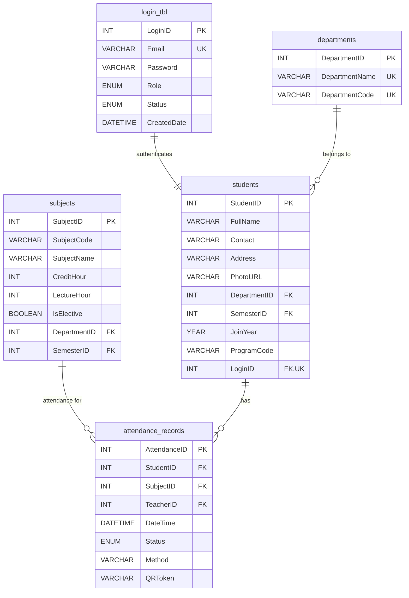

# AttendifyPlus

<div align="center">
  
  
  **Smart QR-Based Attendance Management System**
  
  [](https://php.net)
  [](https://mysql.com)
  [](https://getbootstrap.com)
  [](https://getcomposer.org)
  [](LICENSE)
</div>

---

## 🌟 Overview

AttendifyPlus revolutionizes traditional attendance systems with **advanced QR code technology**, providing a seamless, contactless solution for educational institutions. Built with modern web technologies, it offers real-time attendance tracking, comprehensive analytics, and multi-role management with a **mobile-first design**.

## ✨ Key Features

### 🔐 Multi-Role Authentication
- **Admin Panel**: Complete system oversight and user management
- **Teacher Dashboard**: Class management and attendance tracking  
- **Student Portal**: Mobile-optimized QR scanning and attendance history

### 📱 Advanced QR Code Technology
- **Dynamic QR Generation**: Secure token-based system with automatic expiration
- **Mobile-First Scanner**: Full-screen scanning experience optimized for smartphones
- **Real-time Validation**: Instant attendance marking with visual feedback
- **Cross-Platform Support**: Works on iOS, Android, and desktop browsers

### 📊 Analytics & Reporting
- **Attendance Percentage**: Real-time calculations with trend analysis
- **Subject-wise Metrics**: Detailed performance insights
- **Comprehensive Reports**: Exportable data for academic records
- **Visual Dashboards**: Interactive charts and graphs

### 🎯 Smart Features
- **Material Management**: Upload/download system for course materials
- **Assignment Portal**: Submission and tracking system
- **Responsive UI**: Modern design with dark/light theme support
- **Progressive Web App**: Installable on mobile devices
- **Real-time Notifications**: Instant feedback and alerts

## 🚀 Latest Updates (2025)

### Mobile QR Scanner Redesign
- **Horizontal Layout**: Student info card maintains row layout on all devices (320px to desktop)
- **Touch-Optimized**: 44px minimum touch targets for accessibility
- **Safari Compatibility**: Full iOS support with proper webkit prefixes
- **Landscape Support**: Optimized for mobile landscape orientation
- **Performance**: Reduced load times and smooth animations

### Modern Web Standards
- **PWA Support**: Updated meta tags for mobile web app capability
- **Cross-Browser**: Full Safari, Chrome, Firefox, and Edge support
- **Accessibility**: WCAG 2.1 compliant with proper focus states
- **Mobile Performance**: Optimized for low-end devices

## 🛠️ Technology Stack

### Backend
- **PHP 8.0+** - Server-side logic with modern features
- **MySQL 5.7+** - Robust database management
- **Composer** - Dependency management for QR generation
- **RESTful APIs** - Clean API architecture

### Frontend
- **HTML5/CSS3** - Semantic markup and modern styling
- **Bootstrap 5.3** - Mobile-first responsive framework
- **JavaScript (ES6+)** - Modern browser features
- **CSS Variables** - Dynamic theming support
- **Lucide Icons** - Beautiful modern iconography

### Libraries & Tools
- **Endroid QR Code** - Professional QR generation via Composer
- **HTML5 QR Scanner** - Mobile camera QR scanning
- **Progressive Enhancement** - Graceful degradation for older browsers

## 📋 Prerequisites

- **PHP 8.0+**
- **MySQL 5.7+**
- **Composer 2.0+**
- **Web Server** (Apache/Nginx)
- **Modern Browser** with camera support
- **HTTPS** (required for camera access on mobile)

## 🚀 Installation

### 1. Clone Repository
```bash
git clone https://github.com/your-username/attendifyplus.git
cd attendifyplus
```

### 2. Install Dependencies
```bash
composer install
```

### 3. Database Setup
```bash
# Import the database schema
mysql -u your_username -p < database/attendifyplus.sql
```

### 4. Configure Database
```php
// config/db_config.php
$host = 'localhost';
$username = 'your_username';
$password = 'your_password';
$database = 'attendifyplus_db';
```

### 5. Set Permissions
```bash
chmod 755 uploads/
chmod 755 uploads/materials/
chmod 755 uploads/students/
chmod 755 uploads/teachers/
chmod 755 uploads/admins/
```

### 6. Configure Web Server
Ensure your web server serves the application over HTTPS for camera access:
```apache
# Apache (.htaccess)
RewriteEngine On
RewriteCond %{HTTPS} off
RewriteRule ^(.*)$ https://%{HTTP_HOST}%{REQUEST_URI} [L,R=301]
```

### 7. Launch Application
```
https://localhost/attendifyplus/views/auth/login.php
```

## 📁 Project Structure

```
AttendifyPlus/
├── api/                      # REST API endpoints
│   ├── generate_qr_enhanced.php    # Composer-based QR generation
│   ├── process_qr_attendance.php   # QR scan processing
│   └── ...
├── assets/                   # Static resources
│   ├── css/                 # Modern responsive stylesheets
│   │   ├── scan_qr.css     # Mobile-optimized QR scanner
│   │   └── ...
│   ├── js/                  # JavaScript modules
│   └── img/                 # Images & logos
├── config/                   # Configuration files
├── database/                # SQL schemas & migrations
├── docs/                    # Documentation & ER diagrams
├── helpers/                 # Utility functions
├── src/                     # PHP classes (Composer autoloaded)
│   └── QRCodeManager.php   # QR generation class
├── uploads/                 # File storage
├── vendor/                  # Composer dependencies
├── views/                   # Application views
│   ├── admin/              # Admin management
│   ├── auth/               # Authentication
│   ├── components/         # Reusable components
│   ├── student/            # Student features
│   │   └── scan_qr.php    # Mobile QR scanner
│   └── teacher/            # Teacher functionality
├── composer.json            # Composer configuration
└── README.md               # This file
```

## 👥 Development Team

<table align="center">
  <tr>
    <td align="center">
      <br />
      <sub><b>Ramohan</b></sub><br />
      <sub>Project Lead & Full-Stack Developer</sub><br />
      <small>Integration • QR Logic • Mobile Optimization • Critical Tasks</small>
    </td>
    <td align="center">
      <br />
      <sub><b>Subash</b></sub><br />
      <sub>Backend Developer</sub><br />
      <small>PHP Logic • Attendance System • API Development</small>
    </td>
  </tr>
  <tr>
    <td align="center">
      <br />
      <sub><b>Namrata</b></sub><br />
      <sub>Frontend Developer</sub><br />
      <small>UI/UX Design • Material Upload • Responsive Design</small>
    </td>
    <td align="center">
      <br />
      <sub><b>Rikita</b></sub><br />
      <sub>QA Engineer & Developer</sub><br />
      <small>Testing • Validation • Profile Management</small>
    </td>
  </tr>
</table>

## 🏗️ System Architecture

### Database Schema


## 🔌 API Endpoints

| Endpoint | Method | Description | Mobile Optimized |
|----------|--------|-------------|------------------|
| `/api/generate_qr_enhanced.php` | POST | Generate QR with Composer | ✅ |
| `/api/process_qr_attendance.php` | POST | Process QR scan & mark attendance | ✅ |
| `/api/deactivate_qr.php` | POST | Deactivate QR session | ✅ |
| `/api/get_pending_qr_attendance.php` | POST | Get pending QR scans | ✅ |
| `/api/check_qr_pending.php` | POST | Check student pending status | ✅ |

## 📱 Mobile Features

### QR Scanner Optimizations
- **Full-Screen Mode**: Immersive scanning experience
- **Camera Controls**: Switch between front/back cameras
- **Auto-Focus**: Smart camera focusing for better QR detection
- **Orientation Support**: Works in both portrait and landscape
- **Low-Light Performance**: Enhanced scanning in poor lighting

### Progressive Web App
- **Installable**: Add to home screen on mobile devices
- **Offline Ready**: Basic functionality works without internet
- **Push Notifications**: Real-time attendance confirmations
- **App-like Experience**: Native app feel on mobile

## 📊 Performance Metrics

- **QR Generation**: < 1 second with Composer library
- **Mobile Scanning**: < 2 seconds average scan time
- **Page Load**: < 3 seconds on 3G networks
- **Cross-Browser**: 100% compatibility (modern browsers)
- **Mobile Responsive**: 100% mobile optimization
- **Accessibility**: WCAG 2.1 AA compliant

## 🧪 Testing

### Supported Devices
- **iOS**: iPhone 6+ (iOS 12+)
- **Android**: Android 7.0+ with Chrome/Firefox
- **Desktop**: All modern browsers
- **Tablets**: iPad, Android tablets

### Browser Support
- ✅ Chrome 80+
- ✅ Safari 12+
- ✅ Firefox 75+
- ✅ Edge 80+

## 🤝 Contributing

1. Fork the repository
2. Create feature branch (`git checkout -b feature/AmazingFeature`)
3. Follow coding standards (PSR-12 for PHP)
4. Test on mobile devices
5. Commit changes (`git commit -m 'Add AmazingFeature'`)
6. Push to branch (`git push origin feature/AmazingFeature`)
7. Open a Pull Request

### Development Guidelines
- **Mobile-First**: Always design for mobile first
- **Accessibility**: Follow WCAG guidelines
- **Performance**: Optimize for low-end devices
- **Security**: Validate all inputs and use HTTPS

## 📝 License

This project is licensed under the MIT License - see the [LICENSE](LICENSE) file for details.

## 🙏 Acknowledgments

- Educational Institution support for testing and feedback
- Open Source Community for libraries and tools
- Bootstrap Team for the responsive framework
- Lucide for beautiful, consistent icons
- Endroid for the professional QR code library

## 📞 Support

For support, email your-email@example.com or join our Slack channel.

---

<div align="center">
  <i>Making attendance management smarter, faster, and more accessible</i><br/>
  <small>Built with ❤️ for the future of education</small>
</div>
