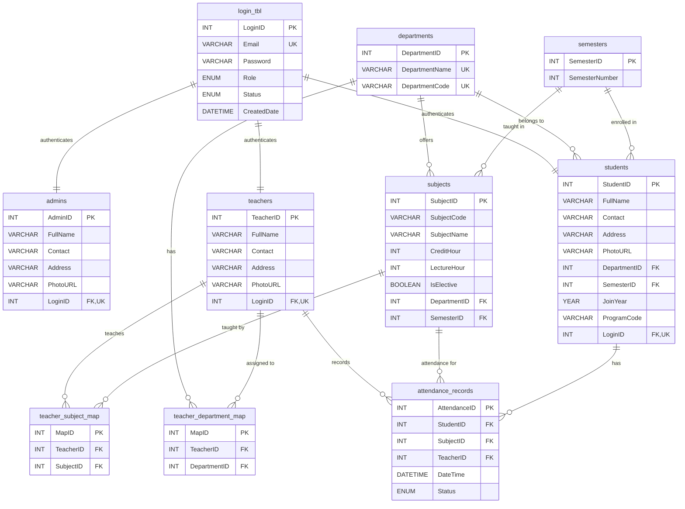

# AttendifyPlus

<div align="center">
  
  
  **Smart QR-Based Attendance Management System**
  
  [](https://php.net)
  [](https://mysql.com)
  [](https://getbootstrap.com)
  [](LICENSE)
</div>

---

## Overview

AttendifyPlus revolutionizes traditional attendance systems with **QR code technology**, providing a seamless, contactless solution for educational institutions. Built with modern web technologies, it offers real-time attendance tracking, comprehensive analytics, and multi-role management.

## Key Features

### Multi-Role Authentication

- Admin Panel: Complete system oversight and user management
- Teacher Dashboard: Class management and attendance tracking
- Student Portal: QR scanning and attendance history

### QR Code Technology

- Dynamic QR generation for each session
- Secure token-based attendance marking
- Real-time validation and processing

### Analytics & Reporting

- Attendance percentage calculations
- Subject-wise performance metrics
- Comprehensive reporting tools

### Smart Features

- Material upload/download system
- Assignment submission portal
- Responsive UI with dark/light themes
- Real-time notifications

## Quick Start

### Prerequisites

- PHP 8.0+
- MySQL 5.7+
- Web server (Apache/Nginx)
- Modern web browser

### Installation

1. **Clone the repository**

   ```bash
   git clone https://github.com/your-username/attendifyplus.git
   cd attendifyplus
   ```

2. **Database Setup**

   ```bash
   # Import the database schema
   mysql -u your_username -p < database/attendifyplus_fainal.sql
   ```

3. **Configure Database**

   ```php
   // config/db_config.php
   $host = 'localhost';
   $username = 'your_username';
   $password = 'your_password';
   $database = 'attendifyplus_db';
   ```

4. **Set Permissions**

   ```bash
   chmod 755 uploads/
   chmod 755 uploads/materials/
   chmod 755 uploads/students/
   chmod 755 uploads/teachers/
   chmod 755 uploads/admins/
   ```

5. **Launch Application**
   ```
   http://localhost/attendifyplus/views/auth/login.php
   ```

## Project Structure

```
AttendifyPlus/
├── api/                 # REST API endpoints
├── assets/              # Static resources
│   ├── css/             # Stylesheets
│   ├── js/              # JavaScript files
│   └── img/             # Images & logos
├── config/              # Configuration files
├── database/            # SQL schemas & backups
├── docs/                # Documentation & diagrams
├── helpers/             # Utility functions
├── uploads/             # File storage
└── views/               # Application views
    ├── admin/           # Admin management
    ├── auth/            # Authentication
    ├── components/      # Reusable components
    ├── student/         # Student features
    └── teacher/         # Teacher functionality
```

## Development Team

<table align="center">
  <tr>
    <td align="center">
      <br />
      <sub><b>Ramohan</b></sub><br />
      <sub>Project Lead & Full-Stack Developer</sub><br />
      <small>Integration • QR Logic • Analytics • Critical Tasks</small>
    </td>
    <td align="center">
      <br />
      <sub><b>Subash</b></sub><br />
      <sub>Backend Developer</sub><br />
      <small>PHP Logic • Attendance System • Backend Processing</small>
    </td>
  </tr>
  <tr>
    <td align="center">
      <br />
      <sub><b>Namrata</b></sub><br />
      <sub>Frontend Developer</sub><br />
      <small>UI/UX Design • Material Upload • Analytics Interface</small>
    </td>
    <td align="center">
      <br />
      <sub><b>Rikita</b></sub><br />
      <sub>QA Engineer & Developer</sub><br />
      <small>Testing • Validation • Profile Management</small>
    </td>
  </tr>
</table>

## Technology Stack

### Backend

- PHP 8.0+ - Server-side logic
- MySQL - Database management
- RESTful APIs - Data communication

### Frontend

- HTML5/CSS3 - Structure & styling
- Bootstrap 5.3 - Responsive framework
- JavaScript (ES6+) - Dynamic interactions
- Lucide Icons - Modern iconography

### Features

- QR Code Generation - Dynamic attendance tokens
- File Upload System - Material & assignment handling
- Real-time Validation - Instant feedback
- Responsive Design - Mobile-first approach

## System Architecture



## API Endpoints

| Endpoint                         | Method | Description                       |
| -------------------------------- | ------ | --------------------------------- |
| `/api/generate_qr_image.php`     | POST   | Generate QR for attendance        |
| `/api/process_qr_attendance.php` | POST   | Process QR scan & mark attendance |

## Usage Statistics

- QR Generation: < 2 seconds
- Mobile Responsive: 100% compatibility
- Security: Token-based validation
- Analytics: Real-time insights

## Contributing

1. Fork the repository
2. Create feature branch (`git checkout -b feature/AmazingFeature`)
3. Commit changes (`git commit -m 'Add AmazingFeature'`)
4. Push to branch (`git push origin feature/AmazingFeature`)
5. Open a Pull Request

## License

This project is licensed under the MIT License - see the [LICENSE](LICENSE) file for details.

## Acknowledgments

- Educational Institution support
- Open Source Community contributions
- Bootstrap Team for the framework
- Lucide for beautiful icons

---

<div align="center">
  <i>Making attendance management smarter</i>
</div>
