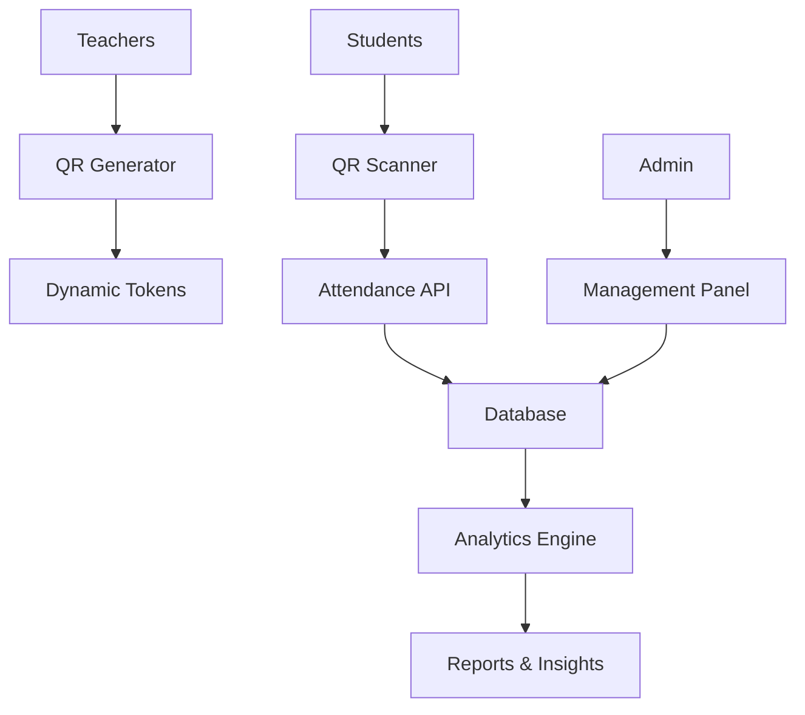

# 🎓 AttendifyPlus

<div align="center">
  
  
  **Smart QR-Based Attendance Management System**
  
  [](https://php.net)
  [](https://mysql.com)
  [](https://getbootstrap.com)
  [](LICENSE)
</div>

---

## 📋 Overview

AttendifyPlus revolutionizes traditional attendance systems with **QR code technology**, providing a seamless, contactless solution for educational institutions. Built with modern web technologies, it offers real-time attendance tracking, comprehensive analytics, and multi-role management.

## ✨ Key Features

### 🔐 **Multi-Role Authentication**
- **Admin Panel**: Complete system oversight and user management
- **Teacher Dashboard**: Class management and attendance tracking  
- **Student Portal**: QR scanning and attendance history

### 📱 **QR Code Technology**
- Dynamic QR generation for each session
- Secure token-based attendance marking
- Real-time validation and processing

### 📊 **Analytics & Reporting**
- Attendance percentage calculations
- Subject-wise performance metrics
- Comprehensive reporting tools

### 🎯 **Smart Features**
- Material upload/download system
- Assignment submission portal
- Responsive UI with dark/light themes
- Real-time notifications

## 🚀 Quick Start

### Prerequisites
- PHP 8.0+
- MySQL 5.7+
- Web server (Apache/Nginx)
- Modern web browser

### Installation

1. **Clone the repository**
   ```bash
   git clone https://github.com/your-username/attendifyplus.git
   cd attendifyplus
   ```

2. **Database Setup**
   ```bash
   # Import the database schema
   mysql -u your_username -p < database/attendifyplus_fainal.sql
   ```

3. **Configure Database**
   ```php
   // config/db_config.php
   $host = 'localhost';
   $username = 'your_username';
   $password = 'your_password';
   $database = 'attendifyplus_db';
   ```

4. **Set Permissions**
   ```bash
   chmod 755 uploads/
   chmod 755 uploads/materials/
   chmod 755 uploads/students/
   chmod 755 uploads/teachers/
   chmod 755 uploads/admins/
   ```

5. **Launch Application**
   ```
   http://localhost/attendifyplus/views/auth/login.php
   ```

## 📁 Project Structure

```
AttendifyPlus/
├── 📂 api/                 # REST API endpoints
├── 📂 assets/              # Static resources
│   ├── css/               # Stylesheets
│   ├── js/                # JavaScript files
│   └── img/               # Images & logos
├── 📂 config/              # Configuration files
├── 📂 database/            # SQL schemas & backups
├── 📂 docs/                # Documentation & diagrams
├── 📂 helpers/             # Utility functions
├── 📂 uploads/             # File storage
└── 📂 views/               # Application views
    ├── admin/             # Admin management
    ├── auth/              # Authentication
    ├── components/        # Reusable components
    ├── student/           # Student features
    └── teacher/           # Teacher functionality
```

## 👥 Development Team

<table align="center">
  <tr>
    <td align="center">
      <br />
      <sub><b>🚀 Ramohan</b></sub><br />
      <sub>Project Lead & Full-Stack Developer</sub><br />
      <small>Integration • QR Logic • Analytics • Critical Tasks</small>
    </td>
    <td align="center">
      <br />
      <sub><b>⚙️ Subash</b></sub><br />
      <sub>Backend Developer</sub><br />
      <small>PHP Logic • Attendance System • Backend Processing</small>
    </td>
  </tr>
  <tr>
    <td align="center">
      <br />
      <sub><b>🎨 Namrata</b></sub><br />
      <sub>Frontend Developer</sub><br />
      <small>UI/UX Design • Material Upload • Analytics Interface</small>
    </td>
    <td align="center">
      <br />
      <sub><b>🔍 Rikita</b></sub><br />
      <sub>QA Engineer & Developer</sub><br />
      <small>Testing • Validation • Profile Management</small>
    </td>
  </tr>
</table>

## 🛠️ Technology Stack

### **Backend**
- **PHP 8.0+** - Server-side logic
- **MySQL** - Database management
- **RESTful APIs** - Data communication

### **Frontend**
- **HTML5/CSS3** - Structure & styling
- **Bootstrap 5.3** - Responsive framework
- **JavaScript (ES6+)** - Dynamic interactions
- **Lucide Icons** - Modern iconography

### **Features**
- **QR Code Generation** - Dynamic attendance tokens
- **File Upload System** - Material & assignment handling
- **Real-time Validation** - Instant feedback
- **Responsive Design** - Mobile-first approach

## 📊 System Architecture



## 🔗 API Endpoints

| Endpoint | Method | Description |
|----------|--------|-------------|
| `/api/generate_qr_image.php` | POST | Generate QR for attendance |
| `/api/process_qr_attendance.php` | POST | Process QR scan & mark attendance |

## 📈 Usage Statistics

- ⚡ **QR Generation**: < 2 seconds
- 📱 **Mobile Responsive**: 100% compatibility
- 🔒 **Security**: Token-based validation
- 📊 **Analytics**: Real-time insights

## 🤝 Contributing

1. Fork the repository
2. Create feature branch (`git checkout -b feature/AmazingFeature`)
3. Commit changes (`git commit -m 'Add AmazingFeature'`)
4. Push to branch (`git push origin feature/AmazingFeature`)
5. Open a Pull Request

## 📄 License

This project is licensed under the MIT License - see the [LICENSE](LICENSE) file for details.

## 🙏 Acknowledgments

- **Educational Institution** support
- **Open Source Community** contributions
- **Bootstrap Team** for the framework
- **Lucide** for beautiful icons

---

<div align="center">
  <b>Built with ❤️ by the AttendifyPlus Team</b><br/>
  <i>Making attendance management smarter, one QR code at a time</i>
</div>